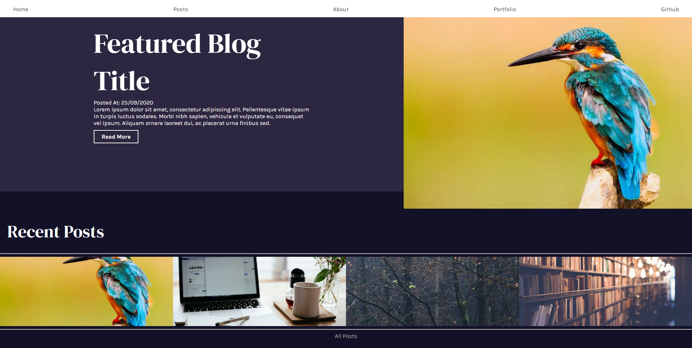
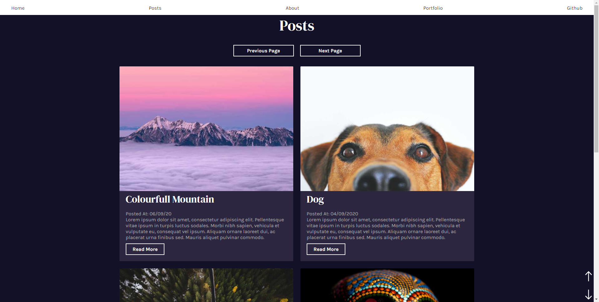
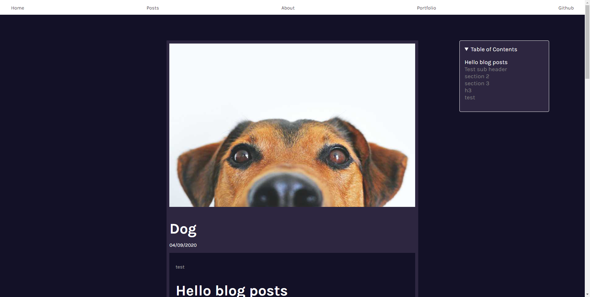

# Gatsby Blog Template project
_Gatsby blog template reading mdx files with graphql_

[live demo](https://pudderz.github.io/Gatsby-Project/blogs/dog)
## Summary
This is a gatsby blog that reads data from markdown via graphql and presents it in a blog format. 

* Master branch - Reads MDX data with a table of content in each blog page
* Markdown-Remark branch - Reads markdown data
* JSON-data branch - Reads JSON data 
## Table of Content
* [Technologies used in this project]()
*  [Features](#features)
*   [Parts of the site]()
    * [Home page](#home-page)
        * [Featured blog](#featured-blog)
        *  [Recent posts](#recent-posts)
    * [list of blogs](#list-of-blogs)
    * [Blog Post](#blog-post)
* [Plugins used](#plugins-used)
* [Installation](#installation)

## Whats is used in this project
* Javascript
* React 
* Gatsby
* GraphQL 
* Sass
* [Gatsby plugins](#plugins-used)
### Features
* PWA
* Blog post arent hard coded and comes from mdx files
## Parts of the site
### Home page

[Home page link](https://pudderz.github.io/Gatsby-Project/)
#### Featured blog
Displays the most recent blog post and the text snippet on load. 
#### Recent Posts
Collects the 4 most recent blog posts and displays them. When hovered over displays date and when clicked changes the featured blog to that post.
### List of blogs

[List of Blogs page](https://pudderz.github.io/Gatsby-Project/posts)

List all blog posts to /posts divided up into multiple pages. I use
gatsby list pagination plugin to split the list of blog posts into multiple pages easily.
### Blog Post

[Blog post link](https://pudderz.github.io/Gatsby-Project/blogs/dog)

Blog post pages are created in the gatsby config files at launch by querying all the blogposts data for MDX files and creating each page with there URL slugs in the MDX frontmatter. When you go onto a blog, the site locates the information by querying with GraphQL the filesystem for an MDX file with the same URL slug.

The page grabs the MDX data matching with the matching slug using GraphQL and displays the information on to the site.


#### Table of content
Reads the ids of each header present and creates a table out of them. The table headers get highlighted when the blog header is present on the screen using intersection observers.


## Plugins used
    gatsby-plugin-offline,
    gatsby-plugin-react-helmet,
    gatsby-transformer-sharp,
    gatsby-plugin-sharp,
    gatsby-plugin-sass,
    gatsby-plugin-html-attributes,
    gatsby-plugin-mdx,
    gatsby-remark-autolink-headers,
    gatsby-remark-slug,
    gatsby-plugin-page-creator,

## Installation
1. git clone/ download files
```
git clone https://github.com/Pudderz/Gatsby-Project.git
```
2. Install dependencies 
```
npm install
```
3. Use the Gatsby CLI to start it up
```
gatsby develop
```
The site is now running at http://localhost:8000
